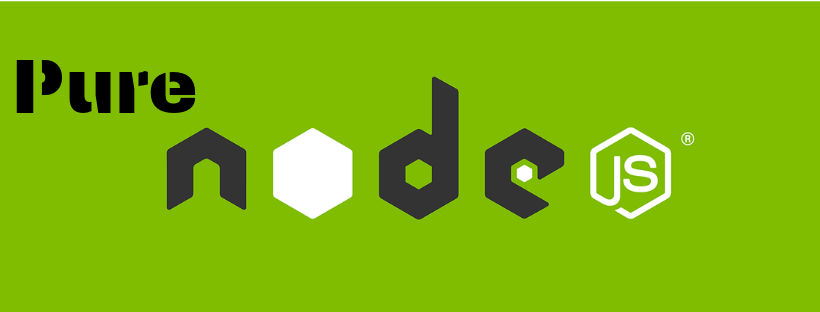
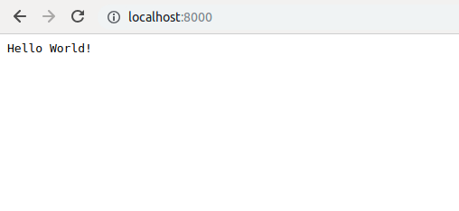

### Node.js is a server-side platform. It is a runtime environment for developing server-side and networking applications. These applications are written in javascript. 

### Before creating an actual “Hello World!” application using Node.js, Let us see the components of a Node.js application. A Node.js application consists of the following some important components.

### **Import HTTP module −**  The simplest way to create HTTP requests in Node.js is by using the require module. Require allows you to make all types of HTTP requests, including, GET, POST, PUT and DELETE.
### **Create server −** The HTTP module can create an HTTP server that listens to server ports and gives a response back to the client. Use the createServer method to create an HTTP server:
### **Send request and receive response −** The server created in an earlier step will read the HTTP request made by the client which can be a browser and return the response.
### **Call with listen() method —** The server.listening property returns true if the server is currently listening for connections, otherwise false.
## Creating Node.js Application
### Step 1 — **Import HTTP Module**
### We use the require directive to load the HTTP module and store the returned HTTP instance into an http variable as follows. Also, set the hostname and port. here IP address ‘127.0.0.1’ means localhost −

```
var http = require("http");
const hostname = '127.0.0.1';
const port = 8000;
```

### Step 2 — **Create Server**
### We use the created HTTP instance and call HTTP.createServer() method to create a server instance. Pass it a function with two parameters. createServer() method takes a callback function as a second argument. This callback function is executed each time the server receives a new request. The callback function takes two arguments, request, and response. The request object contains information regarding the client’s request, such as the URL, HTTP headers, and much more. Similarly, the response object is used to return data back to the client.

```
const server = http.createServer();
server.on('request', (request, res) => {
res.statusCode = 200;
res.setHeader('Content-Type', 'text/plain');
res.end('Hello World!\n');
});
```

### Step 3 — ***listening to the server —***
### Then we bind it at port 8000 using the listen method associated with the server instance. In listen() method we pass two arguments, first is port and second is callback function. use the console.log in callback function for showing a message in terminal. because sometimes run more than one server then maybe we confused which server is running so showing console message clear this confusion.

```
server.listen(port, hostname, () => {
console.log(`Server running at http://${hostname}:${port}/`);
});
```
### Let’s put step 1, 2 and 3 together in a file called main.js and start our HTTP server. These all code is enough to create an HTTP server which listens, i.e., waits for a request over 8000 port on the local machine.

### Now execute the main.js to start the server in the terminal as follows −

### ```$ node main.js```
### Then open a tab in the browser, type hostname, and port and see the magic.


### congratulations “Hello World!” server is ready.